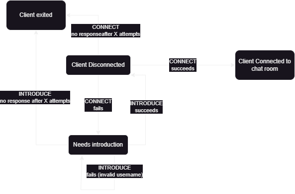

# Handshake Overview

For all responses below, the client will use a timeout amount. If timeout exceeds it will resent request, and any response from the server that was considered timed out by the client will be ignored when received by the client.

### Connect Process
The client uses the connect process to establish a connection with the server. It is used to see whether the server knows this client and whether the client can actively participate in the chat.

1. Client wants to connect to server

    The client sends a CONNECT message to server.

2. Server responds with whether it has this client on record or not
    - Client has certain timeout wait amount
      - if it doesn't receive response from server after certain amount of time it resends
      - After *#* of failed attempts the client gives up saying server is unreachable

    - Server checks to see if IP already has an associated username
    - if client IP already on file with username, server responds with a SUCCESS message and the username it found for the client
    - if client IP does not exist on server, server responds with ERROR message CLIENT_NOT_FOUND

### Introduce Process
In the situation where client connect fails, this means the client still needs to be "introduced" to the server. The INTRODUCE message is used to tell a server about the client (its username) and see if the client can get permission to join the chat.

1. Client wants to introduce itself to the server
    
    The client sends a INTRODUCE message with body containing its desired username.

2. Client waits for server response
    - Client has certain timeout wait amount
      - if it doesn't receive response from server after certain amount of time it resends
      - After *#* of failed attempts the client gives up saying server is unreachable

    - Server checks if username is valid (not already being used by another client)
      - If valid, add username to a LUT which maps src_ip:username.

    - Client receives response from server
      - If username isn't already used, message data contains the username the client sent
        - This is also used as a validation step (if username mismatches client should resend the connect message with the actual username it wanted)
      - If username isn't valid, server sends ERROR response with reason INVALID_USERNAME
        - Client must reattempt CONNECT request with new valid username

---
Once introduction has completed, the client should then reattempt a CONNECT message.